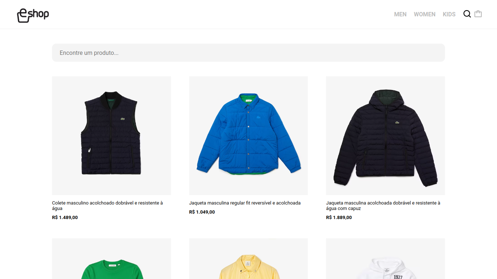
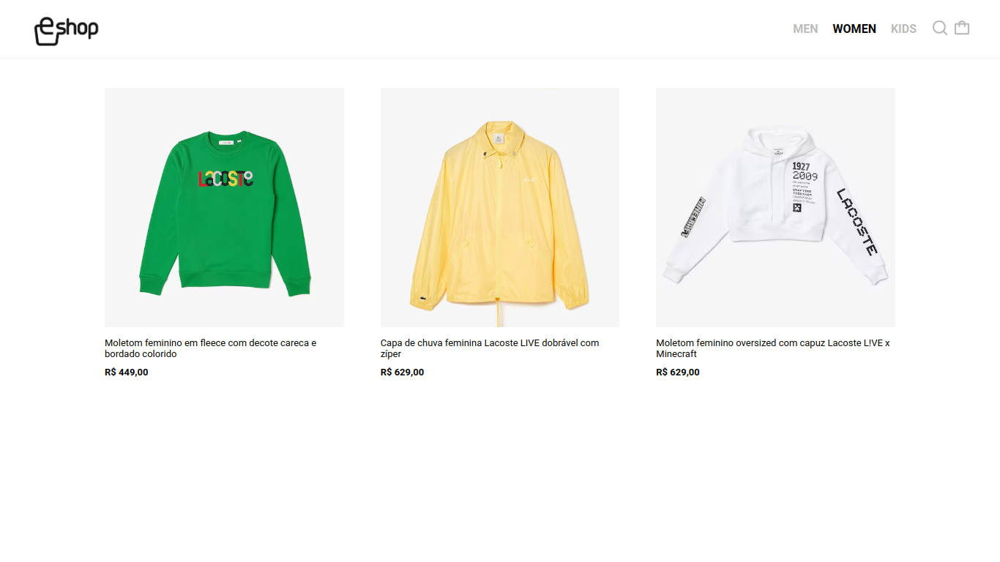
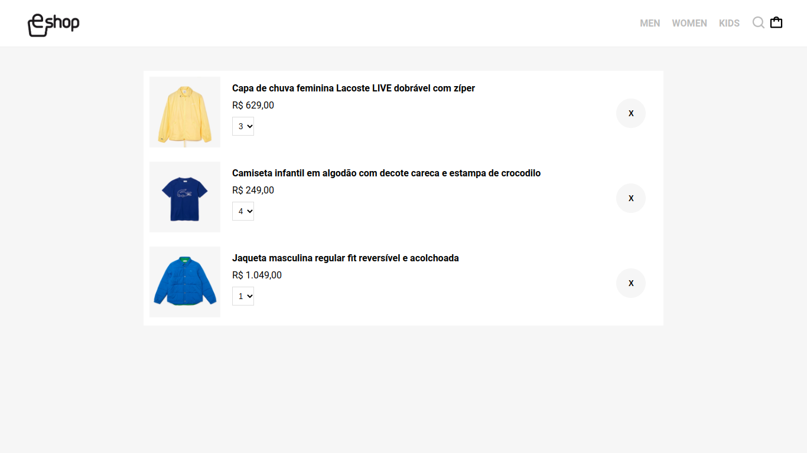

## Desafio 3: Criando e-commerce utilizando Angular

### 🚀 Sobre o desafio

Desafio final do Módulo III - Angular.

Neste projeto foi proposto a criação de um e-commerce front-end utilizando Angular.
<br>
Literalmente meu primeiro projeto com Angular :>

### Rodando a solução

Instale as dependências do projeto:

```
  yarn install
```

Instale o Angular CLI:

```
  yarn add -g @angular/cli
```

Suba o código:

```
  ng serve
```

O projeto estará disponível localmente em `http://localhost:4200/`


### Solução:

<div align="center">
  
</div>

<div align="center">
  
</div>

<div align="center">
  
</div>
