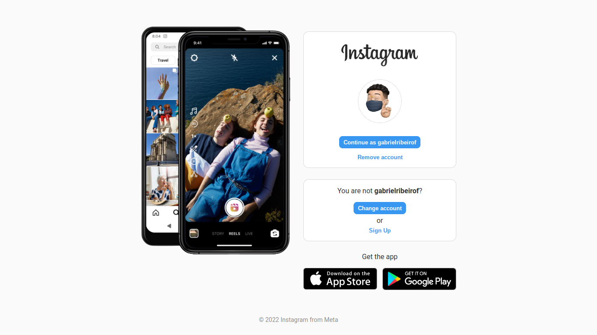

## Desafio 1: Recriando a página inicial do Instagram

### 🚀 Sobre o desafio

Neste projeto foi proposto a recriação da página de login do Instagram.

Técnicas ultilizadas:
- CSS Flexbox
- Responsividade com Media Queries

Solução:

  

